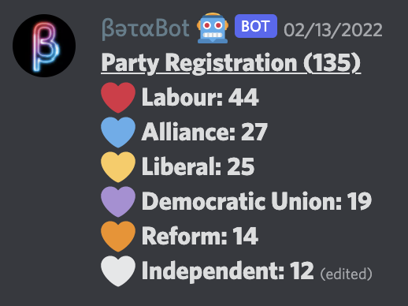
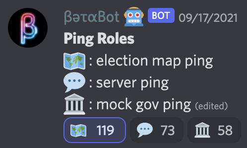
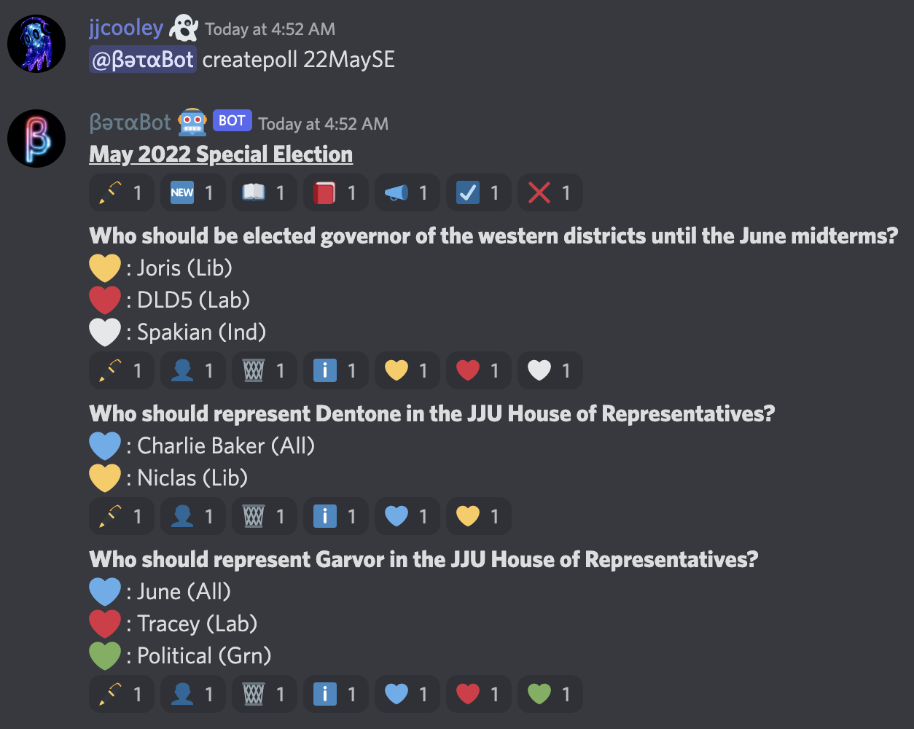
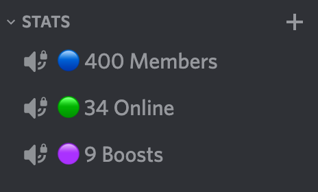
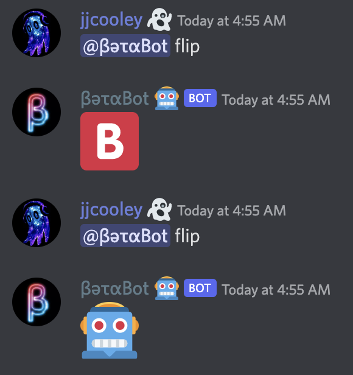

# BetaBot
A multi-purpose Discord bot built using Discord.js and Typescript. Still in beta.

## Features

### Roles

- Reaction role messages
  - React to get the desired role
- Auto-updated role counters
  - Publically display updated role counts
- Randomized role assignments

### Polls

- Visual in-app poll editor
  - Edit poll name, open & closing time
  - Edit poll announcement message
  - Create and delete poll questions
  - Edit question prompts and role access
  - Add options by simply reacting with the desired emote
- Server-wide or DM polls
- "I voted!" role
- Role and time restrictions
- CSV result exports

### Stats

- Auto-updated member stats
  - Displayed on preset locked voice channels
  - Can show total members, est. online members, and boosters
- Message leaderboards

### Misc Commands

- Scheduled commands using cron jobs
- Channel permission toggle for multiple roles and/or channels
- Message purge by count or by reply
- Spelling using emote bitmaps
- Dice

## Development
- `.env` fields
  - `DISCORD_TOKEN`: Client key
  - `CREATOR_USER_ID`: User id for the bot owner
  - `DISCORD_NICKNAME`: Enforced nickname of the bot across all servers
  - `FIRESTORE_KEY_JSON`: Firestore database json object
- `npm install`
- `heroku local`
